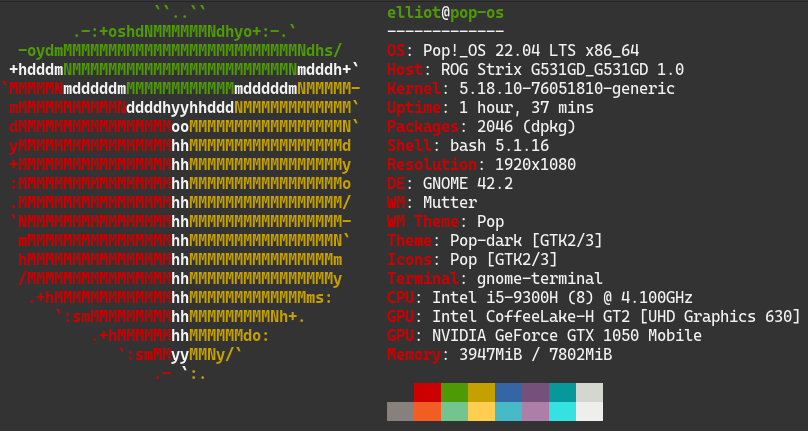
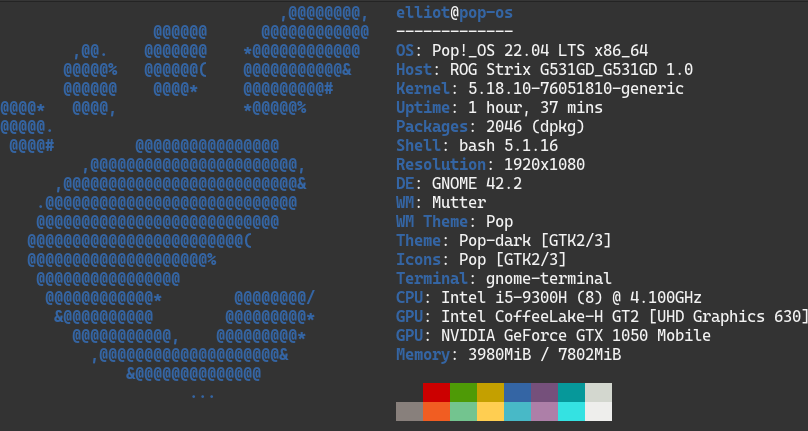
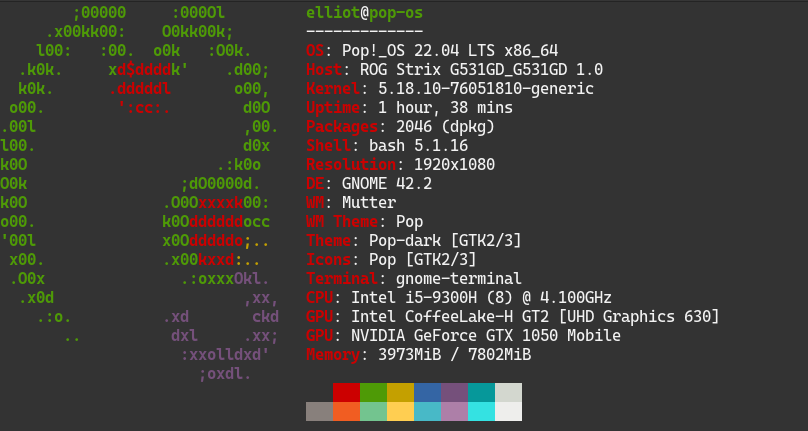
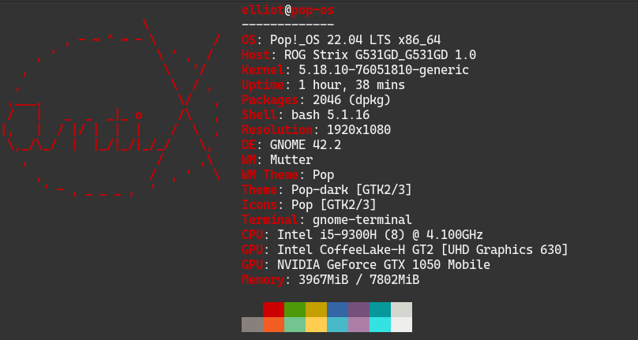
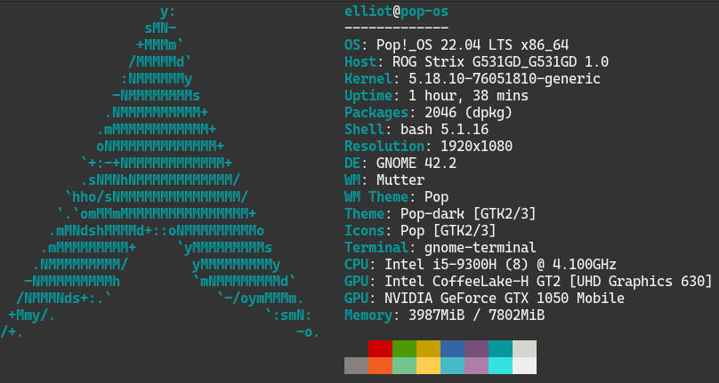
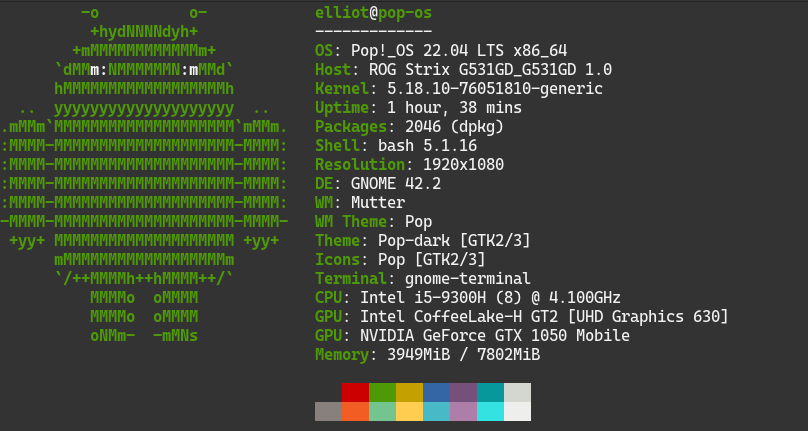
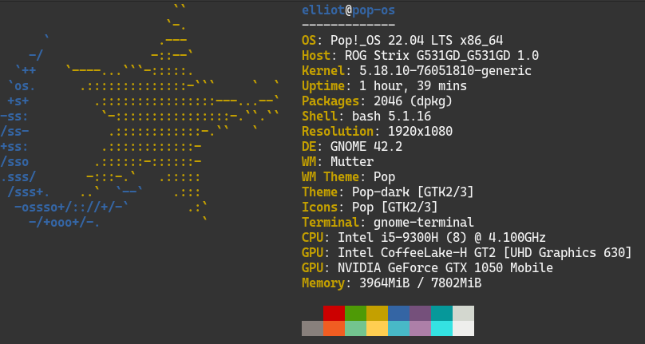

# Neo Random Fetch

Get random os logo whenever you open the terminal.

## Setup

### Install `neofetch`

This may vary for your distro

```sh
sudo apt install neofetch
```


### Clone the repo

```sh
git clone git@github.com:Maheshkumar-novice/NeoRandomFetch.git
```

### Copy the `.neo_random_fetch.sh` to home folder

```sh
cd NeoRandomFetch
cp .neo_random_fetch.sh ~
```

### Update your shell `rc` file

For `.bashrc` append the following to the file,

```sh
# neofetch
if [[ -f ~/.neo_random_fetch.sh ]]; then
	source ~/.neo_random_fetch.sh
	neo_random_fetch
fi
```

### Let's get started!

```sh
. ~/.bashrc
```

### To find out which OS' logo is displaying

```sh
echo $neo_os
```

Enjoy!


### Samples








